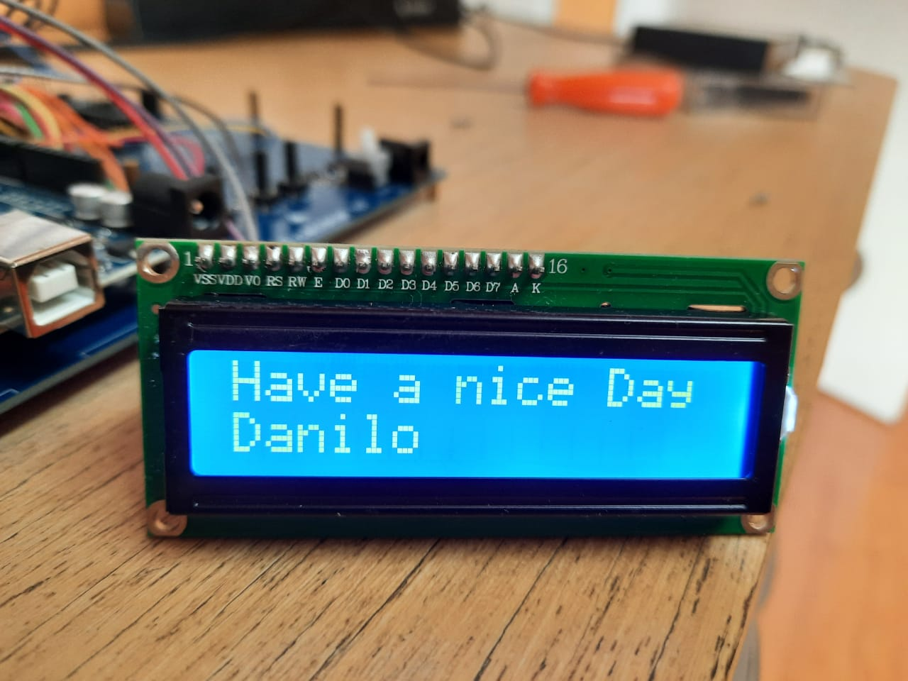

# Programando seu Display I2C 16x2 com o Node-RED

Aprenda como rodar uma aplicação em Python dentro do Node-RED e escreva coisas em seu display 1602

Tentei de diversas formas fazer a Raspberry Pi escrever qualquer coisa no meu Display usando o Node-RED. Contudo não obtive sucesso.  Acabei então indo em busca de ajuda no [Node-RED forum](https://discourse.nodered.org/t/cant-make-a-16x2-lcd-display-work-with-node-red/37400) e compartilho a solução com vocês 
. Finalmente funcionou :)

1. Peimeiramente irei assumir que você já possua o Node-RED instalado em sua Raspberry Pi e que você saiba como abri-lo. Caso não, recomendo os seguintes links:

[Installing Node-Red on a Raspberry Pi](https://pimylifeup.com/node-red-raspberry-pi/)

[Running on Raspberry Pi](https://nodered.org/docs/getting-started/raspberrypi)

2. Ok, agora que o Node-RED está funcionando você deve conectar o display à Raspberry da seguinte forma:

GND(Pin 39 or Pin 9)-----	GND

5V(Pin 2)---------------- VCC

SDA(Pin 3/GPIO 2)-------- SDA

SCL(Pin 5/GPIO 3)-------- SCL

3. Agora vamos ver se a Raspberry Pi "enxerga" o Display. 
No terminal digite:

      i2cdetect -y 1
    
O endereço I²C do Display é mostrado na matriz (0x27)

4. Agora no Node-RED acesse:Menu -> Import

5. Copie o código do link [display_i2c.json](https://github.com/danilo-lorenzo/I-C-16x2-Display-with-Node-RED/blob/main/display_i2c.json)
6. Cole no Clipboard
7. Clique Import

Legal! O Flow pythontest deve ser adicionado 

8. Clique em Deploy e clique no botão do timestamps para ver o código rodando

A primeira linha de nós é um exemplo simples de um código Python rodando no Node-RED, ele irá mostrar a data no Debug (você pode apagar essa linha posteriormente)

Na segunda linha é onde a mágica está. Clique no timestamp e o código deve aparecer no display :)

9. Para mudar o código clique no template node (botão amarelo)
