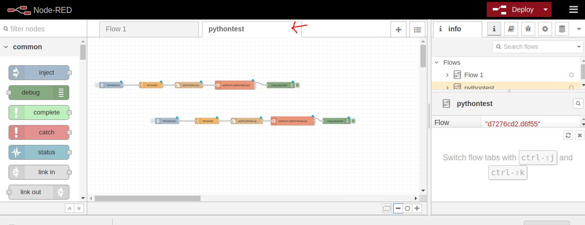
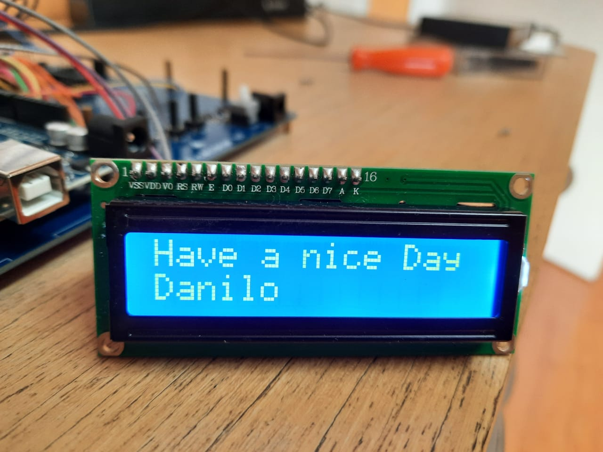

# I2C 16x2 Display with Node-RED

Learn how to run a Python code inside Node-RED to write stuff in a 1602 Display

I tried thousands of different ways to make my Raspberry Pi wright anything in my Display using Node-RED.
So after a good Help from the [Node-RED forum](https://discourse.nodered.org/t/cant-make-a-16x2-lcd-display-work-with-node-red/37400) i get it to work :)

1. First of all i'll assume that you already have Node-RED installed in your Raspberry Pi and that you know how to open it. If you don't ... no problem, i recommend that you follow this links:

[Installing Node-Red on a Raspberry Pi](https://pimylifeup.com/node-red-raspberry-pi/)

[Running on Raspberry Pi](https://nodered.org/docs/getting-started/raspberrypi)

2. Ok now that Node-RED is running you must connect your 1602 display to your Raspberry Pi

GND(Pin 39 or Pin 9)-----	GND

5V(Pin 2)---------------- VCC

SDA(Pin 3/GPIO 2)-------- SDA

SCL(Pin 5/GPIO 3)-------- SCL

3. Now let's see if the Raspberry Pi "see" the Display. 
In the Terminal Write:

      i2cdetect -y 1
    
The display I²C address is shown in the matrix (0x27)

4. Now Open Node-RED -> Menu -> Import

5. Copy the [display_i2c.json](https://github.com/danilo-lorenzo/I-C-16x2-Display-with-Node-RED/blob/main/display_i2c.json) code 
6. Paste it in the Clipboard
7. Hit Import

Nice! The pythontest flow should appear

8. Deploy and hit the timestamps to see the codes running

the first line of nodes is a simple example of a Python code running in Node-RED it will show the date in the Debug (you can erase this line later)

the second one is where the magic is. Hit timestamp and the text should appear in the display :)

9. To change the code open the template node (yellow one)
